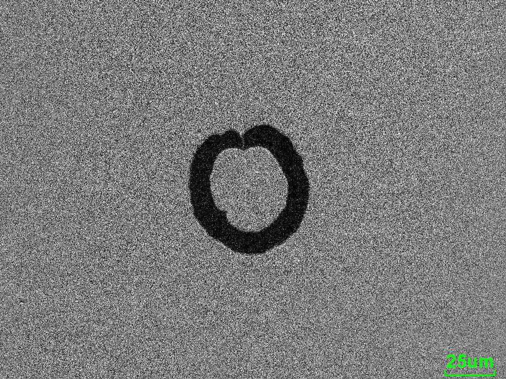

# Automatic bubble detection
This code automatically detects and identifies bubbles in a noisy image using image moments.

Below is an example image of a bubble in a stream of water. The following image shows two red circles that clearly identify the outline of the bubble.

